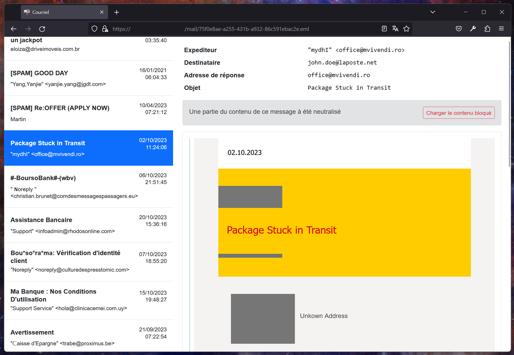

# Blazor FakeWebmail


A fake webmail client using Blazor, Bootstrap and [MimeKit](https://github.com/jstedfast/MimeKit)

This project was developed for educational purposes.

# Usage

### Prepare a set of eml files, store it in a empty directory
for example `C:\TEMP\SPAM`

### Run FWMBuilder With parameters -in and -out
```
	FWMBuilder.exe -in "C:\TEMP\SPAM" -out "[Solution directory]\FakeWebMail\wwwroot\maildata"
```
`-out` parameter is the `maildata` folder inside `FakeWebMail` project
### Run FakeWebMail

You can publish `wwwroot` to a static website